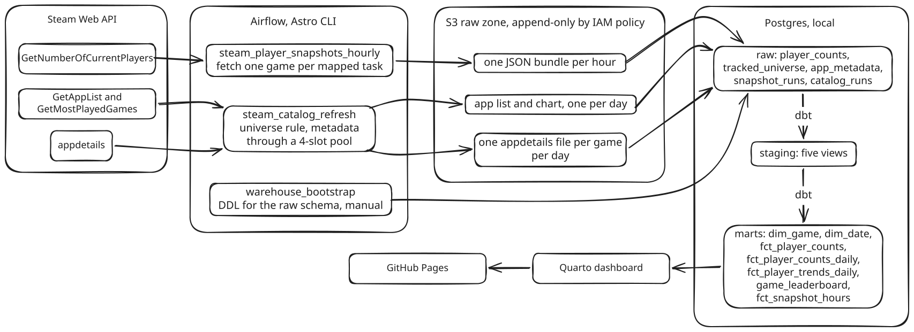

# Steam Player Analytics

A small analytics platform that builds its own dataset by polling Steam's public APIs. Airflow fetches player counts every hour and the catalog every day, lands the raw responses in S3, loads a local Postgres warehouse, and dbt models one business process into a star schema. A Quarto dashboard reads the marts; the published copy is at https://rodrigopita.github.io/steam-player-analytics/.

I built it to keep my Airflow and dbt practice current outside work. It is small enough to run on a laptop and real enough to fail the way production pipelines fail, and when it fails an hour of data is gone for good. The scope and the trade-offs are in [docs/scope.md](docs/scope.md).

## Run it

You need Docker, the [Astro CLI](https://www.astronomer.io/docs/astro/cli/install-cli), [uv](https://docs.astral.sh/uv/), [Terraform](https://developer.hashicorp.com/terraform/install), [Quarto](https://quarto.org/docs/get-started/), an AWS account with the CLI configured, and a free [Steam Web API key](https://steamcommunity.com/dev/apikey).

1. Clone and install the Python tooling. uv fetches Python 3.14 if you do not have it.
   ```bash
   git clone git@github.com:rodrigopita/steam-player-analytics.git
   cd steam-player-analytics
   uv sync --all-groups
   ```
2. Create the raw zone. One bucket and one append-only IAM user, in your account.
   ```bash
   cd terraform
   cp terraform.tfvars.example terraform.tfvars  # set bucket_name and owner
   terraform init && terraform apply
   terraform output -raw airflow_conn_aws_default  # paste into .env below
   cd ..
   ```
3. Configure Airflow. Copy the example and fill in the Steam key, the bucket name and the connection from step 2. The warehouse line stays as it is.
   ```bash
   cp .env.example .env
   ```
4. Start Airflow and the warehouse.
   ```bash
   astro dev start
   ```
   Airflow is at http://localhost:8080, login `admin` / `admin`. The warehouse is Postgres on `localhost:5433`.
5. Bootstrap and fill the universe. In the Airflow UI, trigger `warehouse_bootstrap` once; it creates the `raw` schema. Then unpause and trigger `steam_catalog_refresh`; it builds the tracked universe and fetches metadata, about two minutes. Finally unpause `steam_player_snapshots_hourly`. It runs at every top of the hour; trigger it once if you do not want to wait.
6. Optional: start with three weeks of history. Your instance begins empty. The latest [release](https://github.com/rodrigopita/steam-player-analytics/releases) carries a dump of the raw schema; restoring it is idempotent, so running it twice changes nothing.
   ```bash
   gunzip -c raw-YYYY-MM-DD.sql.gz | PGPASSWORD=steamdw-local psql -h localhost -p 5433 -U warehouse -d steam -v ON_ERROR_STOP=1 -q
   ```
7. Build the marts and open the dashboard.
   ```bash
   source .venv/bin/activate
   (cd dbt && dbt build)
   (cd dashboard && quarto preview)
   ```
   The dashboard footer tells you how fresh what you are looking at is.

To publish your own copy, `quarto publish gh-pages` from `dashboard/` renders against your warehouse and pushes the site to a `gh-pages` branch of your fork.

## Why this architecture

<picture>
    <source media="(prefers-color-scheme: dark)" srcset="docs/architecture-dark.svg">
    
</picture>

- **Three DAGs.** Hourly snapshots and the daily catalog are different flows. A snapshot that fails is lost; a catalog day that fails is covered by the next run. Separate DAGs mean a slow metadata refresh cannot delay a snapshot, and each gets its own audit row. The third, `warehouse_bootstrap`, creates the raw schema once, by hand.
- **Raw JSON in S3 before anything parses it.** Steam cannot be asked about the past, so the response body is the only irreplaceable thing in the system, and it is the one part that does not live on the laptop. Everything below it can be rebuilt from the bundles.
- **Append-only by policy.** The pipeline's IAM user can put, get and list; no statement grants delete. Bucket versioning keeps any overwritten version.
- **Airflow writes `raw`, dbt writes everything else.** Loads use `ON CONFLICT DO NOTHING` on the natural key, so rerunning an hour inserts nothing. Staging views rename, deduplicate and derive; marts are tables.
- **One business process.** Everything measured is a game's concurrent players at an hour. No second ingestion was added to make the schema look bigger.
  - `fct_player_counts` is that fact at its native grain.
  - `fct_player_counts_daily` re-grains it to the day as a dense snapshot: one row per game per day from the game's first day, with unobserved days kept as rows so a window function sees the gap instead of skipping it.
  - `fct_player_trends_daily` adds day-over-day change, seven-day average and days since peak at that grain. They share a grain, so they are columns on one table and the dashboard does one join, not three.
  - `fct_snapshot_hours` is not about games. It is the spine of hours the pipeline should have run, which is why it is a view and not a table.
- **dbt in this repository.** The sources are coupled to what Airflow lands; a schema change is one commit touching both sides.
- **The universe is a rule, not a list.** Every game that has appeared in Steam's most-played top 100 since 2026-08-26, plus a curated seed. Add, never remove; deactivate only on evidence stronger than a missing metadata call. When the chart shifted on 2026-09-16 the rule admitted 32 games in one night and refused the same six non-games it refuses every day.
