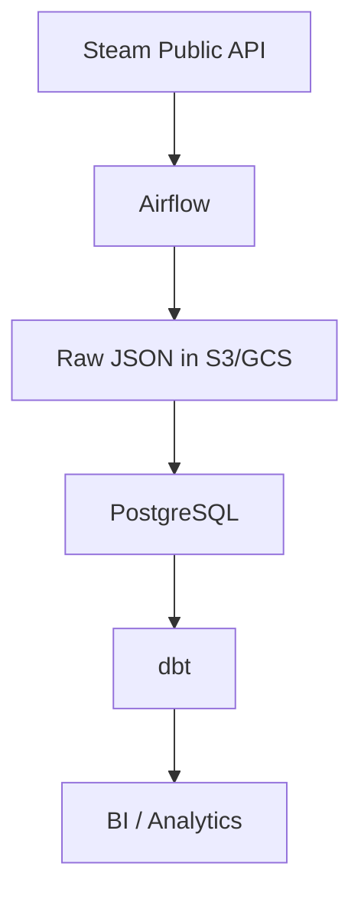

# Project 1 — Steam Player Analytics

## Goal

Build a small analytics platform that creates its own historical dataset by polling Steam's public APIs. The project exists primarily to demonstrate **Airflow, incremental batch ingestion, dbt and relational analytics engineering**.

Market-price ingestion and Redis are intentionally out of scope.

## Tech stack

| Layer          | Technology                                   |
| -------------- | -------------------------------------------- |
| Orchestration  | Airflow (Docker Compose or Astro CLI, local) |
| Ingestion      | Python tasks                                 |
| Landing        | S3 or GCS                                    |
| Warehouse      | PostgreSQL (Docker Compose)                  |
| Transformation | dbt Core                                     |
| BI             | Evidence, Metabase or Streamlit              |

### Architecture

## Data flows

Use two DAGs rather than one mega-DAG:

1. **Catalog / tracked-universe refresh** — discover applications, filter to a deliberately limited tracked universe, and maintain game metadata.
2. **Hourly player snapshots** — fetch current player counts for the tracked universe, store raw responses, load incrementally and model the history.

## Modeling

The single-fact design is deliberate: **one business process, modeled exceptionally well**, rather than adding a second ingestion endpoint merely to make the schema look larger.

Star schema:

- `dim_game`
- `dim_date`
- `fact_player_counts` — hourly grain

Useful models/metrics:

- current leaderboard
- day-over-day changes using `LAG`
- moving averages
- days since historical peak
- daily/weekly activity patterns

## Why PostgreSQL

**Keep PostgreSQL rather than using BigQuery.**

BigQuery is already part of professional experience. PostgreSQL adds a genuinely different relational system without adding unnecessary scale or cost to a small dataset.

The project should demonstrate practical relational engineering: bulk loads, indexes, constraints, upserts and query design.

The design should remain warehouse-portable rather than relying on PostgreSQL-specific behavior unless that behavior is itself the point.

## Why S3/GCS for the raw zone

The rest of the project is local-first. The raw zone is the deliberate exception.

Snapshot observations are irreplaceable: if raw responses lived only in a local Docker volume, one lost volume would destroy data that cannot be re-fetched from the source. Durable object storage protects the only part of the system that cannot be rebuilt. Everything downstream of it (PostgreSQL, dbt models, marts) can be reconstructed from the raw zone at any time.

## Deliberate exclusions

### No market-price pipeline

Player activity alone provides enough engineering depth. Adding market prices creates a second ingestion problem, a second model and additional API failure modes without materially improving the project's main signal.

### No Redis

Redis is useful only if it solves a real problem. Airflow's pool/concurrency controls plus retry/backoff are sufficient for the deliberately limited tracked universe. Redis would add distributed-state complexity without improving the core project signal. It remains available as a stretch experiment, not as a required dependency.

## Engineering focus

### Reliability

- retries and exponential backoff
- an Airflow Pool with limited concurrency for rate-sensitive metadata requests
- idempotent hourly loads
- explicit handling of missing observations
- controlled backfills
- dynamic task mapping where useful

### Data quality

- non-negative player counts
- one logical observation per game and polling interval
- UTC timestamps
- freshness / missing-hour detection
- row-count anomaly checks

### Observability

Track:

- API success/failure rate
- polling latency
- missing intervals
- number of tracked games
- ingestion volume
- most recent successful observation
- observed upstream throttling / response behaviour during the catalog backfill

## Key trade-off

**Snapshot APIs cannot recover missed observations.** A successful rerun cannot recreate an hour that was never observed. Therefore, pipeline uptime and freshness are part of the dataset's quality model.

## Checkpoints (~6 days each)

1. **Skeleton breathes** (`cp1-skeleton`). Docker Compose brings up Airflow and PostgreSQL. One DAG polls player counts for a handful of hardcoded games, writes raw JSON to S3 and loads a raw table. Done when scheduled execution works without manual intervention and produces the expected records. An unattended overnight run is good additional validation, not the criterion.

2. **Tracked universe exists** (`cp2-universe`). The catalog DAG discovers apps, filters to the deliberate universe and fetches metadata through the Airflow pool. Done when the refresh can be killed mid-run, rerun, and still end with a complete `dim_game` and zero duplicates. The test is resumability and idempotency, not "catalog loaded".

3. **Warehouse thinks** (`cp3-model`). dbt staging, star schema and the first window-function marts. Done when `dbt build` is green including tests, and the leaderboard and LAG-based day-over-day queries pass a sanity check against a public reference such as SteamDB. Sampling methodologies differ, so this is a sanity check, not an expected exact match.

4. **Pipeline watches itself** (`cp4-observability`). Audit contract implemented, missing-hour detection live, idempotency proven. Done when a deliberately killed run can be rerun without duplicates, and a query shows exactly which hours are missing and the current high-water mark. This is the project's first recorded failure demonstration.

5. **Stranger can run it** (`cp5-release`). Dashboard published, README answering the eight questions, diagram in place. Done when someone other than me clones the repo and reaches the dashboard following only the README.

## Stretch ideas

Additional Steam endpoints, Redis, or a second fact table may be explored only after the core project is complete. They are not part of the completion criteria.

## What this project proves

> I can design and operate a reliable batch pipeline with Airflow and dbt, model one business process exceptionally well, and explicitly handle data that cannot be backfilled from the source.

## Reference for the API

- [Auth](https://partner.steamgames.com/doc/webapi_overview/auth)
- [API Key](https://steamcommunity.com/dev/apikey)
- [API Terms](https://steamcommunity.com/dev/apiterms)
- [ISteamUserStats](https://partner.steamgames.com/doc/webapi/isteamuserstats)
- [IStoreService](https://partner.steamgames.com/doc/webapi/IStoreService)
- [ISteamApps](https://partner.steamgames.com/doc/webapi/ISteamApps)
